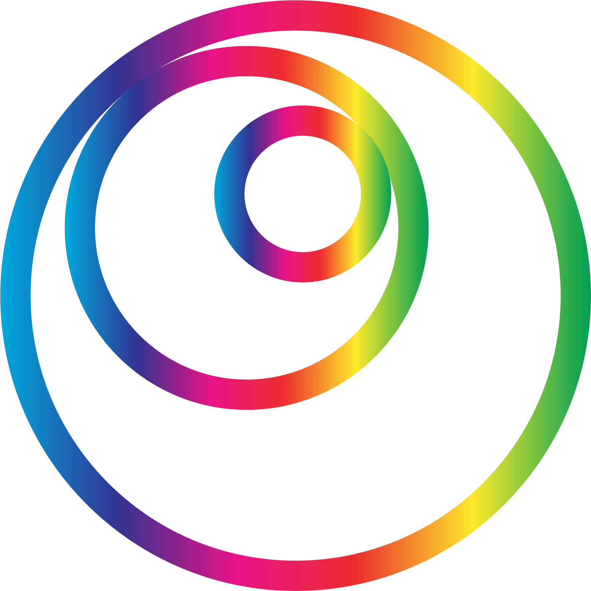

<!-- Improved compatibility of back to top link: See: https://github.com/othneildrew/Best-README-Template/pull/73 -->

<!--
*** Thanks for checking out the Best-README-Template. If you have a suggestion
*** that would make this better, please fork the repo and create a pull request
*** or simply open an issue with the tag "enhancement".
*** Don't forget to give the project a star!
*** Thanks again! Now go create something AMAZING! :D
-->

<!-- PROJECT SHIELDS -->
<!--
*** I'm using markdown "reference style" links for readability.
*** Reference links are enclosed in brackets [ ] instead of parentheses ( ).
*** See the bottom of this document for the declaration of the reference variables
*** for contributors-url, forks-url, etc. This is an optional, concise syntax you may use.
*** https://www.markdownguide.org/basic-syntax/#reference-style-links
-->
[![Contributors][contributors-shield]][contributors-url]
[![Forks][forks-shield]][forks-url]
[![Stargazers][stars-shield]][stars-url]
[![Issues][issues-shield]][issues-url]
[![MIT License][license-shield]][license-url]
[![LinkedIn][linkedin-shield]][linkedin-url]

<!-- PROJECT LOGO -->
 

  

<h3 align="center">Sa@RoyAl</h3>

  

    NodeMCU-based Analog-alike RGB Clock with Android Controller
     
    <a href="https://github.com/alihatamitajik/saat-royal"><strong>Explore the docs »</strong></a>
     
     
    <a href="https://github.com/alihatamitajik/saat-royal">View Demo</a>
    ·
    <a href="https://github.com/alihatamitajik/saat-royal/issues">Report Bug</a>
    ·
    <a href="https://github.com/alihatamitajik/saat-royal/issues">Request Feature</a>
  

<!-- TABLE OF CONTENTS -->

  
Table of Contents

  <ol>
    <li>
      <a href="#about-the-project">About The Project</a>
      <ul>
        <li><a href="#built-with">Built With</a></li>
      </ul>
    </li>
    <li>
      <a href="#getting-started">Getting Started</a>
      <ul>
        <li><a href="#prerequisites">Prerequisites</a></li>
        <li><a href="#installation">Installation</a></li>
      </ul>
    </li>
    <li><a href="#roadmap">Roadmap</a></li>
    <li><a href="#contributing">Contributing</a></li>
    <li><a href="#license">License</a></li>
    <li><a href="#contact">Contact</a></li>
  </ol>

<!-- ABOUT THE PROJECT -->
## About The Project

![Product Name Screen Shot][product-screenshot]

This project is based on development board NodeMCU-8266 and WS2812B RGB LEDs. There are 60, 24 and 12 pieces rings in the
clock face that will represent different information and the clock settings is controlled by REST API (An android app is created
for better control). NodeMCU is on AccessPoint mode and devices must connect to its network first before they can change its
settings. 

Inspired by [This Project](https://www.instructables.com/Neopixel-Clock-With-Three-Neopixel-Rings)

Features:
* Time (Obviously! **3** Different Mode)
* Date (Jalali & Gregorian)
* Battery Percentage
* Temperature of the Room
* Two Beauty Mode (PacMan ᗤ and Rainbow 🌈)
* Alarm (Mario Theme Song)
* Customizable Colors
* REST API

(<a href="#readme-top">back to top</a>)

### Built With

* [![Arduino][Arduino]][Arduino-url]
* [![Android][Android]][Android-url]
* [![VS Code][VSC]][VSC-url]

(<a href="#readme-top">back to top</a>)

<!-- GETTING STARTED -->
## Getting Started

These parts is used:
* NodeMCU ESP8266 CP2102
* NeoPixel Ring - X60/X24/X12 5050 RGB LED WS2812B
* DS1307 - RTC
* Voltage Sensor
* 0.5 Watt 8 Ohm Speaker
* LM386 Mini Amplifier
* Voice Sensor FC-04
* DS18B20 - Temperature Sensor
* Printed watch face and body
* Mini Breadboard
* Jumper Wires
* 18650 Battery Shield V3 + 18650 Battery

### Prerequisites

Connect the parts to the board. Change the `#define`s relatively.

Libraries:
* ESP8266 (Board should be added to Arduino IDE ([help](https://randomnerdtutorials.com/how-to-install-esp8266-board-arduino-ide/)))
* RTClib (With this exact title)
* [ESPAsync](https://reacoda.gitbook.io/molemi-iot/introducing-the-nodemcu/display-the-dht11-sensor-reading-on-a-web-server-using-nodemcu./installing-dht-library-on-the-esp8266/installing-the-asynchronous-web-server-library) 
* Adafruit NeoPixel
* DallasTemperature
* OneWire

### Installation

The main program of the board can be found [HERE](code). Program the board and Enjoy! 

(<a href="#readme-top">back to top</a>)

## RoadMap

- [ ] Adding TF card that will play a custom sound
  - [ ] TF card wiring
  - [ ] Sound transfer API

<!-- CONTRIBUTING -->
## Contributing

Contributions are what make the open source community such an amazing place to learn, inspire, and create. Any contributions you make are **greatly appreciated**.

If you have a suggestion that would make this better, please fork the repo and create a pull request. You can also simply open an issue with the tag "enhancement".
Don't forget to give the project a star! Thanks again!

1. Fork the Project
2. Create your Feature Branch (`git checkout -b feature/AmazingFeature`)
3. Commit your Changes (`git commit -m 'Add some AmazingFeature'`)
4. Push to the Branch (`git push origin feature/AmazingFeature`)
5. Open a Pull Request

(<a href="#readme-top">back to top</a>)

<!-- LICENSE -->
## License

Distributed under the MIT License. See `LICENSE.txt` for more information.

(<a href="#readme-top">back to top</a>)

<!-- CONTACT -->
## Contact

Your Name - [@alihatamitajik](https://twitter.com/alihatamitajik) - a [DOT] hatam008 [AT] gmail [DOT] com

Project Link: [https://github.com/alihatamitajik/saat-royal](https://github.com/alihatamitajik/saat-royal)

(<a href="#readme-top">back to top</a>)

<!-- MARKDOWN LINKS & IMAGES -->
<!-- https://www.markdownguide.org/basic-syntax/#reference-style-links -->
[contributors-shield]: https://img.shields.io/github/contributors/alihatamitajik/saat-royal.svg?style=for-the-badge
[contributors-url]: https://github.com/alihatamitajik/saat-royal/graphs/contributors
[forks-shield]: https://img.shields.io/github/forks/alihatamitajik/saat-royal.svg?style=for-the-badge
[forks-url]: https://github.com/alihatamitajik/saat-royal/network/members
[stars-shield]: https://img.shields.io/github/stars/alihatamitajik/saat-royal.svg?style=for-the-badge
[stars-url]: https://github.com/alihatamitajik/saat-royal/stargazers
[issues-shield]: https://img.shields.io/github/issues/alihatamitajik/saat-royal.svg?style=for-the-badge
[issues-url]: https://github.com/alihatamitajik/saat-royal/issues
[license-shield]: https://img.shields.io/github/license/alihatamitajik/saat-royal.svg?style=for-the-badge
[license-url]: https://github.com/alihatamitajik/saat-royal/blob/master/LICENSE
[linkedin-shield]: https://img.shields.io/badge/-LinkedIn-black.svg?style=for-the-badge&logo=linkedin&colorB=555
[linkedin-url]: https://linkedin.com/in/ali-hatami-tajik/
[product-screenshot]: report/demo.jpg
[Arduino]: https://img.shields.io/badge/%20-Arduino-00979D?style=for-the-badge&logo=Arduino&logoColor=fff
[Arduino-url]: https://Arduino.cc
[VSC]: https://img.shields.io/badge/%20-VS%20Code-007ACC?style=for-the-badge&logo=Visual%20Studio%20Code&logoColor=fff
[VSC-url]: https://code.visualstudio.com/
[Android]: https://img.shields.io/badge/%20-Android-3DDC84?style=for-the-badge&logo=Android&logoColor=fff
[Android-url]: https://www.android.com/