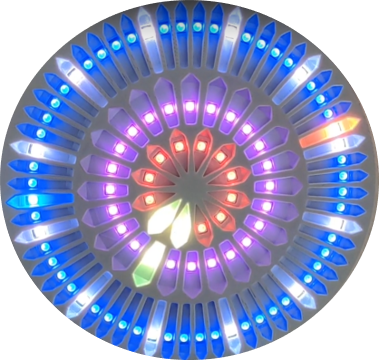

<h1 align="center">
    ساعت دیجیتال عقربه ای
</h1>

پروژه درس سیستم های نهفته
 
جناب آقای دکتر انصاری
 
علی حاتمی - رویا قوامی - سارا آذرنوش
 
زمستان ۱۴۰۰

## طرح ساعت

طراحی مد نظر به این صورت است که نمایش زمان با استفاده از سه حلقه متحدالمرکز از LED های RGB با اندازه‌های ۶۰، ۲۴ و ۱۲ صورت خواهد گرفت.

شکل صفحه ساعت (Watch Face) به صورت زیر خواهد بود:

طرح سه بعدی قابل پرینت این صفحه از 
[این لینک](https://skfb.ly/oroGy)
قابل مشاهده است. لازم به ذکر است این یک طرح Original نبوده و از یک طرح آمده از اینترنت تحت لیسانس Creative Common استفاده شده است.

## لوازم مورد نیاز
این لوازم با توجه به ناحیه مصرف آنها عبارت‌اند از:

- **پردازشی**:
  - NodeMCU بر پایه EPS8266 با چیپ CH340G
- **روشنایی**: برای روشنایی این ساعت از led های WS2812B پکیج 5050 استفاده خواهد شد. پیشتر از این تکنولوژی کنترل کردن led ها به خصوص در تعداد بالا بیشتر شبیه به یک کابوس بود اما با استفاده از این led های آدرس پذیر با اتصال آنها به صورت daisy chain و تنها با استفاده از یک خط داده آنها را کنترل کرد. برای این ساعت از ۹۶ عدد از آنها به شرح زیر استفاده خواهد شد:
  - NeoPixel Ring - X60 5050 RGB LED WS2812B
  - NeoPixel Ring - X24 5050 RGB LED WS2812B
  - NeoPixel Ring - X12 5050 RGB LED WS2812B
- **ساعت**
  - Real-time Clock DS1307 with I2C Interface
- **توان**: برای تامین توان این ساعت به دو صورت عمل می‌شود. یک آداپتور ۵ ولت برای روشن کردن led ها و آمپلی‌فایر استفاده می‌شود. از یک باطری سکه‌ای برای روشن نگه‌داشتن ماژول ساعت و از یک باطری لیتیوم-یون قابل شارژ برای توان بخشی به میکروکنترلر استفاده می‌شود تا در صورت قطع برق ماژول تنظیمات آن از دست نرود.
  - Li-Ion 18650 Battery 2200
  - 18650 Battery holder
  - LF33CV 3.3 V Regulator
  - 5 V Adaptor for powering LEDs
  - Power jack
  - Charge module for Lithium batteries TP4056 with Type C Connector
- **صوت**:
  - 0.5 Watt 8 Ohm Speaker
  - LM386 Mini Amplifier
  - Micro SD Card Module
- **ملزومات ساخت**
  - Printed watch face and body
  - Mini Breadboard 
  - Jumper Wires
  - Soldering iron + ...

## قابلیت‌ها
- نمایش ساعت (با چند نحوه نمایش متفاوت)
- دارای mode هایی برای استفاده به عنوان چراغ خواب یا تزئین
- قابلیت کنترل و تغییر برنامه و اطلاع از وضعیت فعلی توسط اپلیکیشن موبایل
- هشدار (آلارم)
- تفاوت رنگ در روز و شب
- حالات متفاوت رنگ
- قابلیت‌های احتمالی:
  - نمایش تاریخ
  - نمایش وضعیت‌آب و هوا
  - نمایش تعداد ایمیل