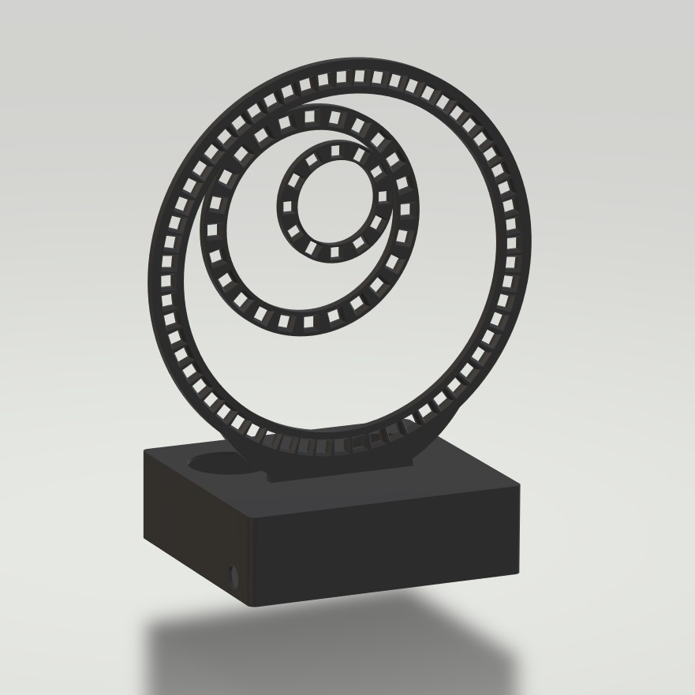

# گزارش انجام پروژه درس سیستم‌های نهفته (ساعت هوشمند)

# آماده‌سازی
این فاز شامل دو مرحله کلی است:
1. خرید لوازم مورد نیاز
2. باز طراحی بدنه و کیس

از آنجایی که پس از تهیه تجهیزات به این مورد برخورد کردیم که LED های خریداری شده متناسب با طرحی که در پروپوزال ارائه شده بود (که از اینترنت گرفته شده بود) نیست، یک بدنه و کیس از ابتدا طراحی شد. فایل بدنه و کیس طراحی شده در کنار این گزارش قرار گرفته‌اند.

